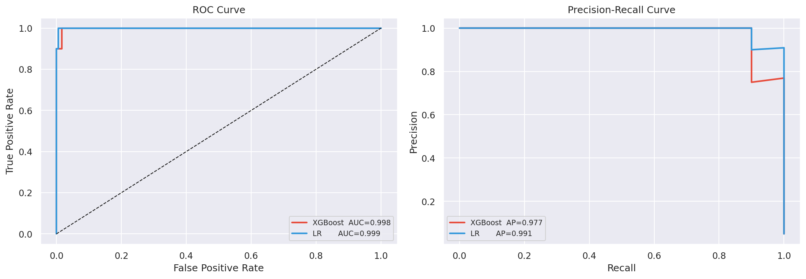
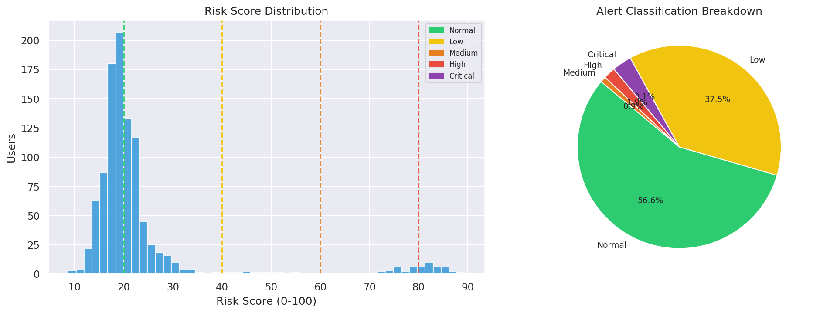
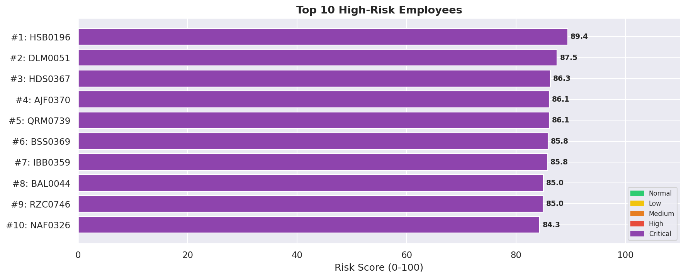
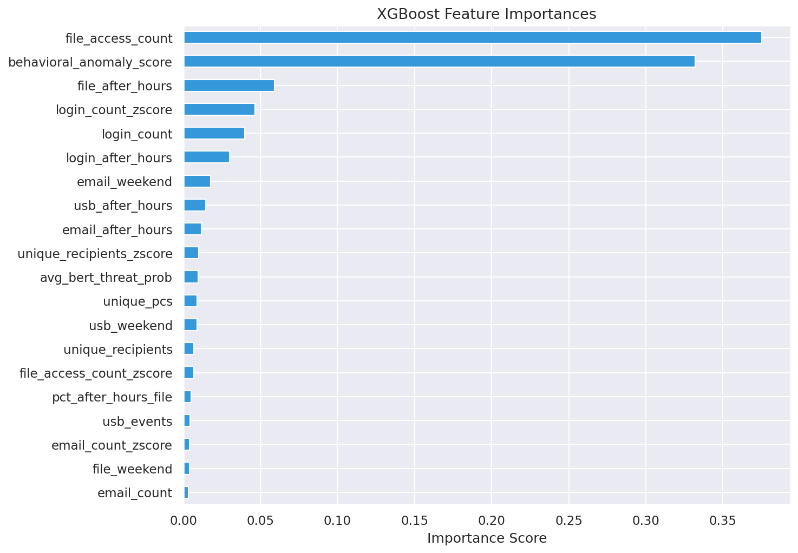

# LLM-Assisted Insider Threat Detection System

A real-time behavioral threat detection system that combines NLP, anomaly detection, 
and graph analysis to identify insider threats from multi-modal activity logs.

## Problem Statement
Insider threats are among the hardest cybersecurity risks to detect — they originate 
from trusted users with legitimate system access. Traditional rule-based systems miss 
subtle behavioral shifts. This system analyzes patterns across email, file access, 
and login activity to generate actionable risk scores before damage occurs.

## Tech Stack
- **NLP:** DistilBERT (Hugging Face Transformers)
- **Anomaly Detection:** Isolation Forest (Scikit-learn)
- **Graph Analysis:** NetworkX
- **Backend / Dashboard:** Flask
- **Data Processing:** Pandas, NumPy
- **Dataset:** CERT Insider Threat Dataset v6.2

## System Architecture

**Input Layer**
> Behavioral Logs — Email · File Access · Login Activity

**Processing Layer**

| Module | Method | Output |
|---|---|---|
| NLP Engine | DistilBERT | Sentiment & intent score |
| Anomaly Detector | Isolation Forest | Behavioral outlier score |
| Graph Analyzer | NetworkX | Relationship & comm score |

**Output Layer**
> Weighted Score Fusion → Risk Score (0–100) → Flask Dashboard
## Key Features
- Multi-modal log processing across 3 data sources simultaneously
- DistilBERT fine-tuned for email sentiment and intent classification
- Isolation Forest for detecting statistical outliers in behavioral patterns
- NetworkX graph analysis to map communication relationships between users
- Weighted score fusion engine combining all signals into a single risk metric
- Flask dashboard displaying per-user risk scores, timelines, and top-10 alerts

## Results
- Processed and analyzed behavioral logs across email, file, and login channels
- Generated interpretable 0–100 risk scores with per-user breakdowns
- Visualized ROC/PR curves, risk timelines, and feature importance charts
- Identified top 10 high-risk users with supporting behavioral evidence

## Visualizations
| ROC / PR Curves | Risk Overview |
|---|---|
|  |  |

| Top 10 Risk Users | Feature Importance |
|---|---|
|  |  |

## How to Run
```bash
# Install dependencies
pip install -r requirements.txt

# Run the application
python main.py

# Or use the batch file (Windows)
run.bat
```
Then open `http://localhost:5000` in your browser.

## Model Weights
The DistilBERT fine-tuned weights are not included in this repo due to size.
Base model: `distilbert-base-uncased` from Hugging Face.
Download via:
```python
from transformers import DistilBertTokenizer, DistilBertModel
tokenizer = DistilBertTokenizer.from_pretrained('distilbert-base-uncased')
model = DistilBertModel.from_pretrained('distilbert-base-uncased')
```

## Future Improvements
- Real-time log streaming with Apache Kafka
- LSTM-based sequential behavior modeling
- Role-based access control for the dashboard
- Alert notification system via email/Slack
